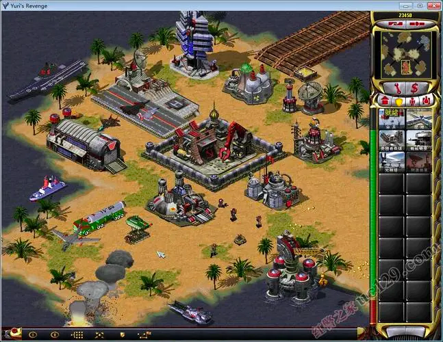

### 空间方位
 
左X，右Y，上Z，方块正好相对外点的位置为(0,0,0)点
### tile进行分类
方便扩展地形，不同的图片同样的作用
### 类魔兽设计
建筑，单位，都是单位，主要存储数据，通过其上面挂载的组件实现各种行为，栈式结构，每次入栈都是新行为实例
采用事件，事件中有参数决定是否向后传递，攻击，移动，上车等行为都是事件获取可以处理的组件，组件进行处理
绘制需要单独独立出来，可以在绘制上挂载事件，绘制那个动画有对应api控制
### 界面参考

### 一切皆对象
树木也设置为对象，矿物也是对象，矿物也可以阻挡行走(看情况吧，不阻挡就不设置进统一格子)
### 优化显示数量
右边菜单范围内可以不显示，单位也要控制是否显示，所有绘制不在屏幕内的都要过滤掉，绘制时传入绘制的大范围，超出范围的自动过滤

### 一些还没用上的语音
uwarning.wav  间谍入侵各种建筑
uselbuil.wav  变卖建筑
siroon.wav  启动铁幕
snuklaun.wav  核弹发射
snuksire.wav  核爆预警  snukintr.wav  snukexpl.wav 核爆

移动音效，在移动时间过长例如5s时再播放

事件使用广播机制，(卡牌游戏那一套都用的上)
不同单位可以采用不同的网格大小(星际)，移动时碰到阻塞，阻塞一段时间，还不恢复就重新寻路

## OLD
### 寻路
单位会找距离目标点最近，且自己最近到达的
单位除了移动状态，都会让路
小兵下三角分布
小兵坦克绝不重叠，需要移动到目标点让对方让路
小兵，坦克每次移动的终点必定是格子
移动到目标点时会尽量保持队形，多块队伍进行合并
允许八方向寻路
### 特性
完全基于格子，格子(二维)存在高度属性，记录该 x,z的最大高度，供飞行单位参考
光标变化，选择单位也基于格子
辐射也是按格子来染色
### 地图tile
地面，水面，桥，四方向斜坡，悬崖墙
### 组件化，状态栈
有新行为入栈执行，方便回退到原来的状态，移动，转向，攻击，idle都是可以入栈的(例如攻击要先移动到对应位置，可以先入栈移动，之后弹栈攻击)，这些都是多例，因为栈中可能包含多个移动，但是绘制等不会入栈的可以采用实例单例
### 配置读取
配置可以有缺省，有配置后置处理器保证配置的完整
### 单位与建筑进行统一，有什么能力由组件决定，方便管理
### 移动攻击需要两个状态栈
这里暂时不做走A部分
主状态：移动，(移动转向,攻击转向)转向，idle，攻击   可以委托其他行为
副状态：攻击，(攻击转向)转向   攻击状态，找目标攻击，但是不会触发移动，且处于主攻击状态该副状态失效
### 多组件交互
除了直接调用组件的一些通用方法(也可以添加一些新的接口)，还可以在组件共同依附的对象上添加Extra字段供组件访问存储
### 尝试红警那样的地图格式
位置定位采用函数映射解决，通过函数映射确定每个格子的位置，根据位置判断处于的格子
注意在格子粒度的，笛卡尔坐标系与等距坐标系装换，其他的沿用老逻辑即可
### 建造实现
默认集结点就是建筑本身，生产类建筑可以设置集结点
单位展开为建筑
### 攻击实现
### 单位染色
只有绿色通道有颜色时把他占255的比例缩放到其他纯色并应用可以参考TestTint的实现

